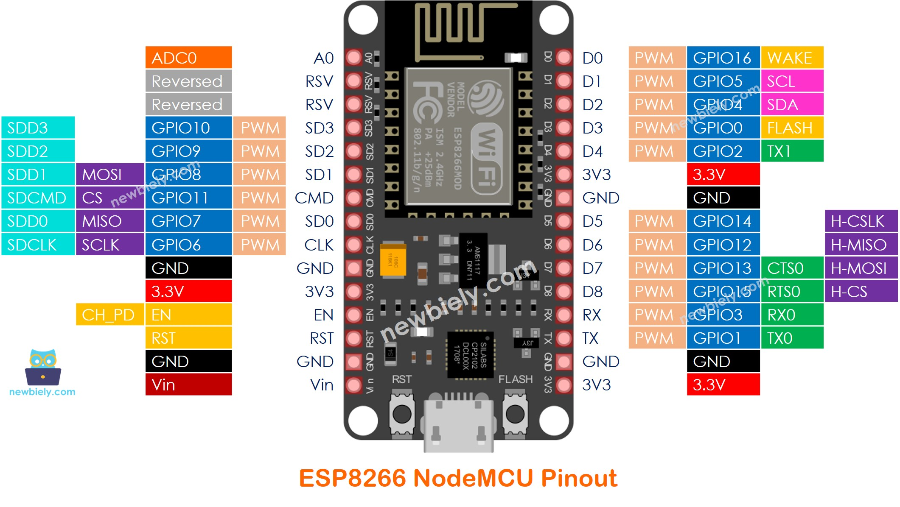
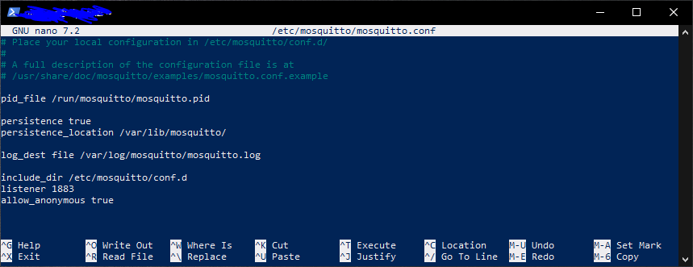
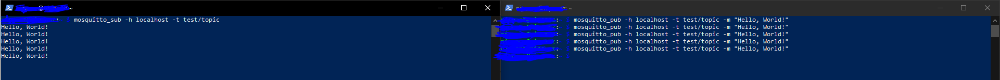
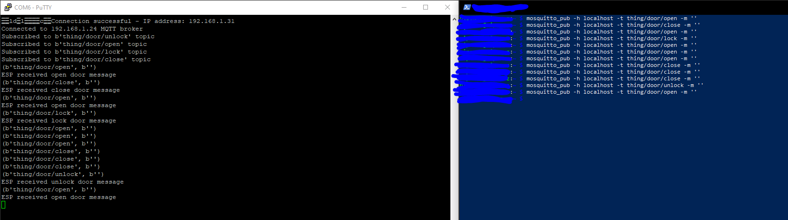
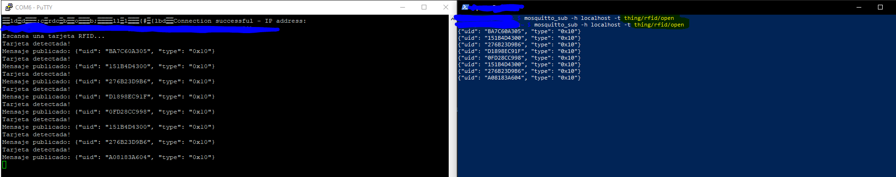
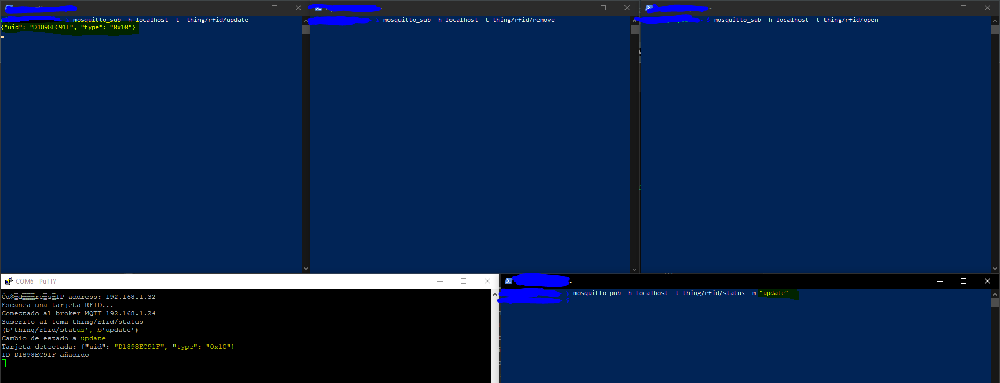
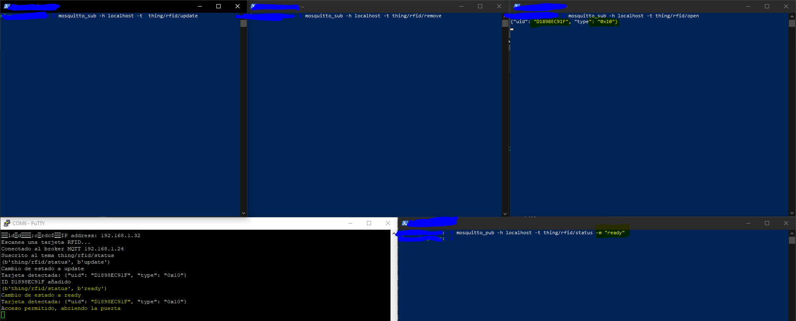
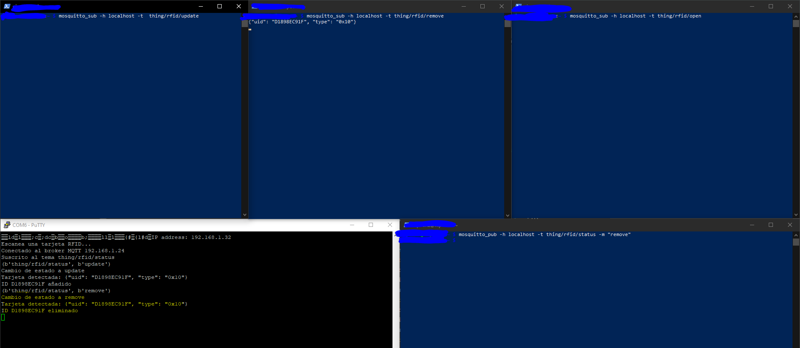
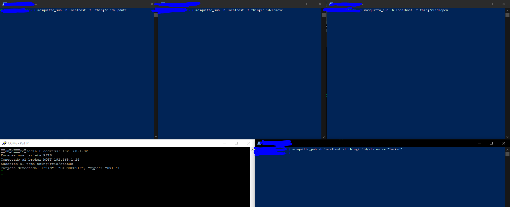

<p align="center">
  <a href="http://nipoanz.com/" target="blank"></a>
</p>

# Rfid Iot Project

Este proyecto tiene como objetivo controlar el acceso a una puerta utilizando un sistema RFID, un ESP8266 y una arquitectura en la nube a través de AWS IoT Core. Inicialmente, el proyecto se configura para conectar con un broker MQTT (Mosquitto) en una Raspberry Pi. Posteriormente, se implementará en la nube de AWS.

## Instalar
1. Clonar el repositorio:
    ```sh
    git clone https://github.com/potier97/rfid-access-iot.git
    cd rfid-access-iot
    ```

2. Crear y activar el entorno virtual:
    ```sh
    python -m venv env
    # En Windows
    .\env\Scripts\activate
    # En macOS y Linux
    source env/bin/activate
    ```

3. Instalar dependencias:
    ```sh
    pip install -r requirements.txt
    ```


## Tabla de Contenidos

1. [Introducción](#introducción)
2. [Requisitos](#requisitos)
3. [Conexión Componentes](#conexión-componentes)
3. [Instalación del Broker Mosquitto](#instalación-del-broker-mosquitto)
4. [Ampy - Transferencia de Archivos](#ampy---transferencia-de-archivos)
5. [Configuración Inicial del ESP8266](#configuración-inicial-del-esp8266)
7. [Migración a AWS IoT Core](#migración-a-aws-iot-core)
8. [Contribuciones](#contribuciones)
9. [Autor](#autor)
9. [Licencia](#licencia)


---
## Introducción
El proyecto `RFID Access IoT` permite gestionar el acceso a una puerta utilizando tarjetas RFID. La información de acceso se gestiona a través de un **ESP8266** que se comunica con un **broker MQTT** alojado en una Raspberry Pi y, en futuras versiones, con AWS IoT Core.

Se hace uso de la libreria `umqtt.simple` para la comunicación MQTT en el ESP8266, puede encontrar la documentación [aquí](https://pypi.org/project/micropython-umqtt.simple/).


---
## Requisitos
 - Raspberry Pi con Raspbian instalado
 - ESP8266 con MicroPython
 - Módulo RFID (MFRC522)
 - Servomotor
 - Tarjetas RFID
 - Mosquitto instalado en la Raspberry Pi
 - Conexión a Internet

---
## Conexión Componentes

La conexión de los componentes se realiza para dos dispositivos, uno para el control del servo (Puerta) y otro para el lector RFID. La conexión se realiza de la siguiente manera:

Tenga en cuenta los pines I/O de la ESP8266

<br>
<p align="center" >
  <a href="http://nipoanz.com/" target="blank">
  
  </a>
</p>

### ESP8266 - Control Puerta (Un Dispositivo)

<br>

| ESP8266     | Servo |
|-------------|-------|
| D5 (GPIO14) | Signal|
| NN          | VCC   |
| GND         | GND   |


 > El servo se alimenta con 5V de una fuente independiente y se comparte la tierra (GND) con el ESP8266.

 Se conecta un led en el pin D0 (GPIO16) para indicar el estado del dispositivo.

### ESP8266 - Lector RFID (Dos Dispositivos)

<br>

| ESP8266     | Lector RFID |
|-------------|-------------|
| D5 (GPIO14) | SCK         |
| D7 (GPIO13) | MOSI        |
| D6 (GPIO12) | MISO        |
| D1 (GPIO5)  | RST         |
| D2 (GPIO4)  | SDA         |
| GND         | GND         |
| 3V3         | 3.3V        |

 > El lector RFID se alimenta con 3.3V y se comparte la tierra (GND) con el ESP8266.

 Se conecta un led en el pin D0 (GPIO16) para indicar el estado del dispositivo.


---
## Instalación del Broker Mosquitto

1. Instalar Mosquitto:
    
    ```sh
    sudo apt update
    sudo apt upgrade -y
    sudo apt install -y mosquitto mosquitto-clients
    ```

2. Iniciar el servicio de Mosquitto:
    
    ```sh
    sudo systemctl enable mosquitto
    ```

    **Importante**: Es necesario modificar el archivo ubicado en `/etc/mosquitto/mosquitto.conf` para habilitar la autenticación de usuarios y la comunicación por el puerto 1883. Para ello, edite el documento usando `nano`

    > sudo nano /etc/mosquitto/mosquitto.conf
     Agruegue las siguientes líneas al final del archivo:
        - listener 1883
        - allow_anonymous true

    Su archivo debería verse de la siguiente manera:

    <br>
    <p align="center" >
    <a href="http://nipoanz.com/" target="blank">
    
    </a>
    </p>

    Iniciar o reinice el servicio el servicio: `start` o `restart`

    ```sh
    sudo systemctl start mosquitto
    ```

3. Comprobar que el servicio está en ejecución:
    
    ```sh
    sudo systemctl status mosquitto
    ```

4. Hacer pruebas de conexión con el broker:
    En una terminal, suscribirse a un tópico:

    ```sh
    mosquitto_sub -h localhost -t test
    ```

    En otra terminal, publicar un mensaje en el tópico:

    ```sh
    mosquitto_pub -h localhost -t test -m "Hello, world!"
    ```

    > Deberías ver el mensaje en la terminal donde te suscribiste al tópico.


<br>
<p align="center" >
  <a href="http://nipoanz.com/" target="blank">
  
  </a>
</p>

---
## Ampy - Transferencia de Archivos

Para transferir archivos al ESP8266, utilizaremos `ampy`. Para instalarlo, ejecuta el siguiente comando:
```sh
pip install adafruit-ampy
```

- Para verificar que `ampy` se instaló correctamente, ejecuta el siguiente comando:
```sh
ampy --help
```

- Trasferir archivos al ESP8266:
```sh
ampy --port com6 put main.py
```

- Obtener la lista de archivos en el ESP8266:
```sh
ampy --port com6 ls
```

- Obtener un archivo del ESP8266:
```sh
ampy --port com6 get main.py
```

- Eliminar un archivo del ESP8266:
```sh
ampy --port com6 rm main.py
```

## Configuración Inicial del ESP8266

El desarrollo d este proyecto se realiza de acuerdo a este otro proyecto: [ESP8266-MicroPython](https://bhave.sh/micropython-mqtt/).

### Esp8266 + RPI (Local) - Control Puerta

Este ejemplo consiste en la publicación de mensajes desde una ESP8266 que se conecta a un broker MQTT en una Raspberry Pi. Este captura los posible mensjaes a los que está suscrito y actúa en consecuencia.

Principalmente, el ESP8266 se conecta a la red WiFi y al broker MQTT. Luego, se suscribe a un tópico y publica mensajes en otro tópico.

Los mensajes a los que está suscrito son unicamente para `abrir o cerrar la puerta` y `bloquear o desbloquear la puerta`, que consiste en mover un servo a distintos grados.

 <br>
<p align="center" >
<a href="http://nipoanz.com/" target="blank">

</a>
</p>

El código del ESP8266 se encuentra en el archivo `door.py` y se puede transferir al ESP8266 utilizando `ampy`. Este consiste en una clase llamada `Door` y es explicada a continución:	

### Comandos MQTT
 - thing/door/open: Abre la puerta (mueve el servo a 180°).
 - thing/door/close: Cierra la puerta (mueve el servo a 0°).
 - thing/door/lock: Bloquea la puerta (desactiva el servo y apaga el LED).
 - thing/door/unlock: Desbloquea la puerta (activa el servo y enciende el LED).

Una vez que el ESP8266 esté conectado al broker MQTT, enviará y recibirá mensajes para controlar la puerta. Asegúrate de que tu broker MQTT esté funcionando correctamente y que los temas MQTT estén configurados según tu necesidad.

Ejemplo de Publicación de Mensajes
Puedes usar cualquier cliente MQTT para enviar mensajes a los temas correspondientes. Aquí hay un ejemplo usando mosquitto_pub:

```bash
# Abrir la puerta
mosquitto_pub -h <broker_ip> -t thing/door/open -m ""

# Cerrar la puerta
mosquitto_pub -h <broker_ip> -t thing/door/close -m ""

# Bloquear la puerta
mosquitto_pub -h <broker_ip> -t thing/door/lock -m ""

# Desbloquear la puerta
mosquitto_pub -h <broker_ip> -t thing/door/unlock -m ""
```

 > Por el momento el mensaje a enviar es vacío, se espera que este se pueda enviar la información de la tarjeta RFID.


La clase Door controla la lógica del sistema de acceso. Aquí tienes una explicación de sus componentes principales:

- **Constructor** (__init__): Inicializa los atributos del objeto Door, conecta al servidor MQTT y configura las suscripciones a los temas.

```python
def __init__(self, mqtt_server, client_id, thing_name, servo_pin=14, led_pin=16):
```

- **Callback de Suscripción** (sub_cb): Maneja los mensajes recibidos y llama a las funciones correspondientes según el tema del mensaje.

```python
def sub_cb(self, topic, msg):
```

- **Funciones de Manejo**: Controlan las acciones de abrir, cerrar, bloquear y desbloquear la puerta.

```python
def handle_open(self):
def handle_close(self):
def handle_lock(self):
def handle_unlock(self):
```

- **Reconexión** (restart_and_reconnect): Reinicia el ESP8266 y reconecta al broker MQTT en caso de error.

```python
def restart_and_reconnect(self):
```

- **Conexión y Suscripción** (connect_and_subscribe): Conecta al servidor MQTT y se suscribe a los temas necesarios.

```python
def connect_and_subscribe(self):
```

- **Escucha de Mensajes** (listen): Mantiene el ESP8266 escuchando mensajes MQTT y maneja las excepciones.

```python
def listen(self):
```

La clase `main.py` inicializa el sistema y ejecuta la lógica principal.

- **Ejecución Principal**: Crea una instancia de la clase Door y llama a la función listen para comenzar a escuchar los mensajes MQTT.

```python
if __name__ == '__main__':
    client_id = ubinascii.hexlify(unique_id())
    mqtt_server = '192.168.1.24'
    thing_name = 'thing'
    door_controller = Door(mqtt_server, client_id, thing_name)
    door_controller.listen()
```

### Esp8266 + RPI (Local) - Control RFID

Este sección muestra cómo utilizar un lector RFID para leer tarjetas y enviar la información al servidor MQTT. El sistema está diseñado para detectar tarjetas RFID y publicar el UID de la tarjeta en un tema MQTT. (Ejemplo Simple), este lo puede encontrar en el archivo `scripts/main_read_rfid.py`.

 > El uso de RFID se basa en el proyecto de [Micropython RFID](https://github.com/cefn/micropython-mfrc522/blob/master/examples/read.py)

El código inicializa el LED y configura los pines para el lector RFID.

```python
from machine import Pin, SoftSPI, unique_id
from time import sleep
from ubinascii import hexlify
from umqtt.simple import MQTTClient
import mfrc522
import ujson

# Inicializa el LED
led = Pin(16, Pin.OUT)

# Configuración del lector RFID
sck = Pin(14, Pin.OUT)
mosi = Pin(13, Pin.OUT)
miso = Pin(12, Pin.IN)

# Configuración del pin de interrupción
print("Escanea una tarjeta RFID...")
```

#### Configuración del Cliente MQTT
Se configura el cliente MQTT para conectarse al servidor y definir el tema donde se publicarán los mensajes.

```python	
# Configuración del cliente MQTT
mqtt_server = 'BROKER_IP'
client_id = hexlify(unique_id())
topic_pub = 'thing/rfid/open'

client = MQTTClient(client_id, mqtt_server)
client.connect()
```

#### Lectura de Tarjetas RFID

Se configura el lector RFID y se define la función read_rfid para leer las tarjetas y obtener el UID.

Cuando se detecta una tarjeta, el código convierte el UID a formato hexadecimal y crea un mensaje JSON. Este mensaje se publica en el tema thing/rfid/open.

```python
spi = SoftSPI(baudrate=100000, polarity=0, phase=0, sck=sck, mosi=mosi, miso=miso)
spi.init()
rdr = mfrc522.MFRC522(spi, gpioRst=5, gpioCs=4)

# Función para leer la tarjeta y obtener el UID
def read_rfid():
  while True:
    (stat, tag_type) = rdr.request(rdr.REQIDL)
    if stat == rdr.OK:
      (stat, uid) = rdr.anticoll()
      if stat == rdr.OK:
        print("Tarjeta detectada!")
        uid_hex = ''.join(['{:02X}'.format(x) for x in uid])
        # Crear el mensaje JSON
        message = ujson.dumps({
            "type": "0x%02x" % tag_type,
            "uid": uid_hex
        })
        # Publicar el mensaje en el tema MQTT
        client.publish("thing/rfid/open", message)
        print("Mensaje publicado:", message)
        # Enciende el LED para indicar que se ha leído la tarjeta
        led.value(1)
        sleep(1)
        led.value(0)

# Ejecutar la lectura
read_rfid()
```

Ejemplo de implementación de la lectura de tarjetas RFID.

 <br>
<p align="center" >
<a href="http://nipoanz.com/" target="blank">

</a>
</p>

### Implementación de la Lógica de Control de Acceso mediante Tarjetas de RFID

Este apartado consiste en la configuración de las esp8266 para extender la lógica anterior en los controles primarios de acceso mediante los siguientes publicaciones sobre el broker MQTT, cabe agregar que la comunicación de este dispositivo se realiza en doble vía, es decir, este nodo se suscribe a unos topics para actualizar el estado del lector, y publica en otros para enviar la información de las tarjetas RFID que se detectan.

### Comandos MQTT - Publicaciones
 - thing/rfid/open: Envia el UID y tipo de la tarjeta RFID para soliciar el acceso.
 - thing/rfid/update: Envia los datos de las tarjetas RFID para asociar a un usuario nuevo o actualizar la información de un usuario existente.
 - thing/rfid/remove: Envio de la información de la tarjeta RFID para eliminarla de la lista de permitidos y desasoaciarla de un usuario.

### Comandos MQTT - Suscripciones
 - thing/rfid/status: Actualiza el estado del lector RFID `locked` - `ready` - `remove` - `update`.

### Ejemplo - Estado update - Agregar Tarjeta

En este ejemplo se agrega una tarjeta RFID a la lista de permitidos, para ello se envía la información de la tarjeta al broker MQTT. Es recibido por la suscripción `thing/rfid/update`


> Para ejemplos practicos se agrega el UID de la tarjeta en memoria del dispositivo RFID.


<br>
<p align="center" >
<a href="http://nipoanz.com/" target="blank">

</a>
</p>

### Ejemplo - Estado ready - Abrir Puerta

De acuerdo al ejemplo anterior, al tener un UID de una tarjeta guarda en memoria, se cambia el estado a `ready` para que el lector RFID envie el UID de la tarjeta y su tipo a la suscripción `thing/rfid/open` para solicitar el acceso.

> Hay que tener por lo menos una tarjeta en memoria para que el sistema funcione, posteriormente el listado de aceptados persistirá en una base de datos en la Nube de AWS.

<br>
<p align="center" >
<a href="http://nipoanz.com/" target="blank">

</a>
</p>

### Ejemplo - Estado remove - Eliminar Tarjeta

El estado del lector se debe cambiar a `remove` para remover accesos de la lista de permitidos.

En este ejemplo se elimina una tarjeta RFID de la lista de permitidos, para ello se envía la información de la tarjeta en la publicación `thing/rfid/remove`

<br>
<p align="center" >
<a href="http://nipoanz.com/" target="blank">

</a>
</p>


### Ejemplo - Estado Bloqueado - No ejecuta acciones

Cuando se cambia al estado `locked` el lector RFID no ejecuta ninguna acción, esto se puede utilizar para bloquear el acceso a la puerta.

<br>
<p align="center" >
<a href="http://nipoanz.com/" target="blank">

</a>
</p>

## Contribuciones

1. Hacer un fork del repositorio.
2. Crear una nueva rama (`git checkout -b feature-nueva-funcionalidad`).
3. Hacer commit de los cambios (`git commit -am 'Agregar nueva funcionalidad'`).
4. Hacer push a la rama (`git push origin feature-nueva-funcionalidad`).
5. Crear un Pull Request.


## Autor

- [Nicolas Potier](https://github.com/potier97/)

## Licencia
Este proyecto está bajo la Licencia MIT.