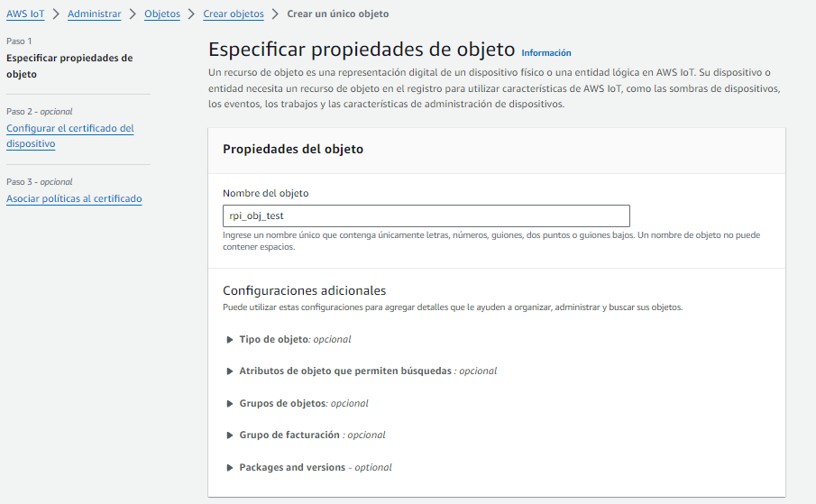
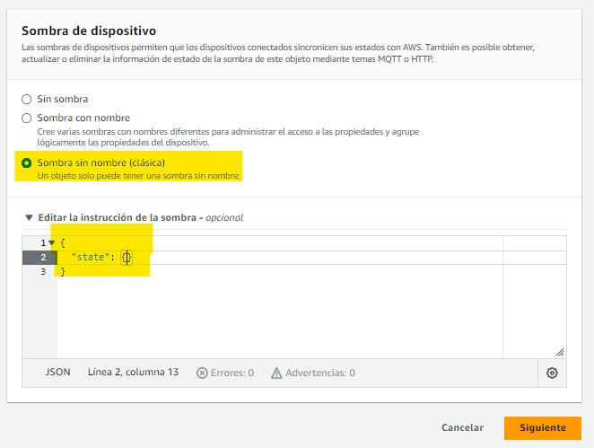
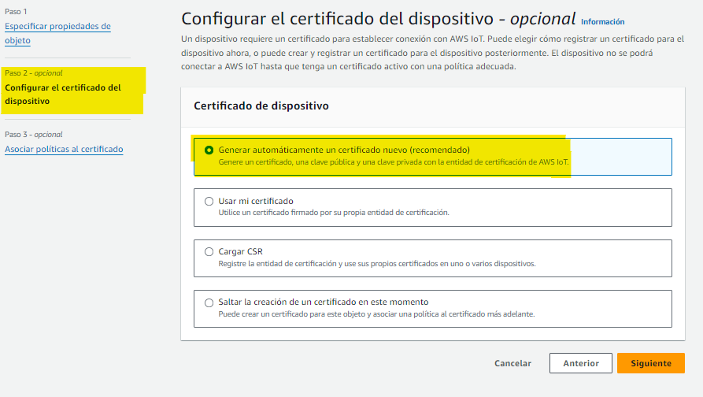
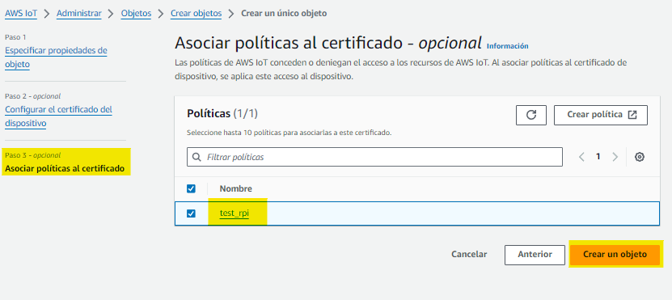
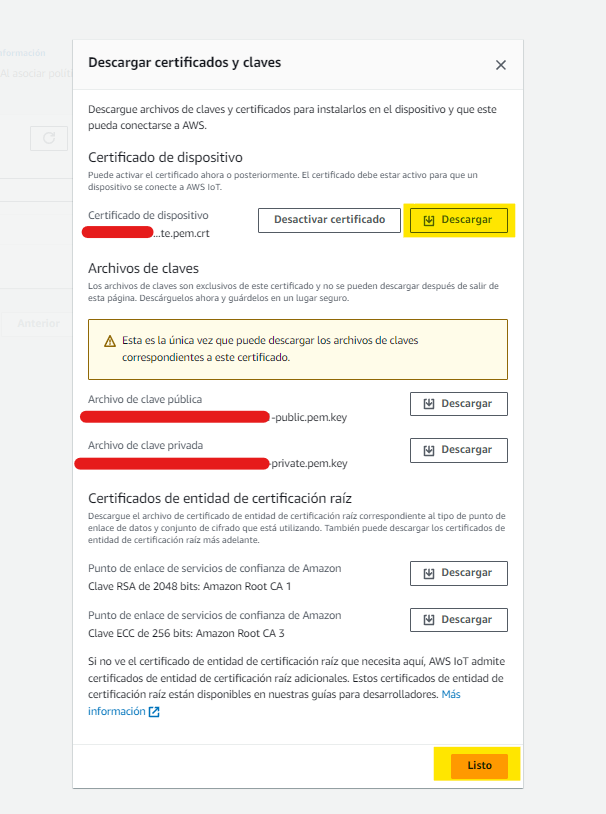
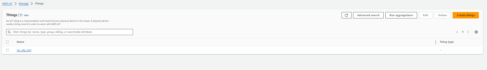
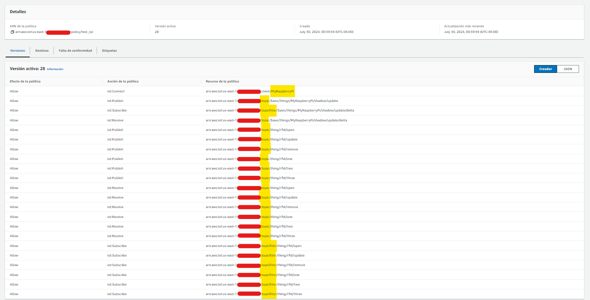
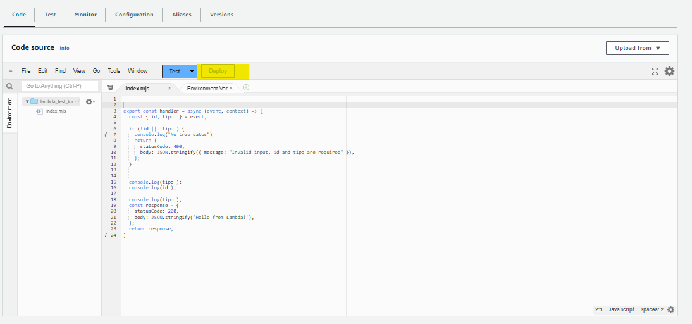

<p align="center">
  <a href="http://nipoanz.com/" target="blank"></a>
</p>

# Rfid Iot Project

Este proyecto tiene como objetivo controlar el acceso a una puerta utilizando un sistema RFID, un ESP8266 y una arquitectura en la nube a través de AWS IoT Core. Inicialmente, el proyecto se configura para conectar con un broker MQTT (Mosquitto) en una Raspberry Pi. Posteriormente, se implementará en la nube de AWS.

Este proyecto está inspirado la siguiente publicación de AWS [Aquí](https://aws.amazon.com/es/blogs/iot/using-micropython-to-get-started-with-aws-iot-core/).


## Instalar
1. Clonar el repositorio:
    ```sh
    git clone https://github.com/potier97/rfid-access-iot.git
    cd rfid-access-iot
    ```

2. Crear y activar el entorno virtual:
    ```sh
    python -m venv env
    # En Windows
    .\env\Scripts\activate
    # En macOS y Linux
    source env/bin/activate
    ```

3. Instalar dependencias:
    ```sh
    pip install -r requirements.txt
    ```


## Tabla de Contenidos

1. [Introducción](#introducción)
2. [Requisitos](#requisitos)
3. [Conexión Componentes](#conexión-componentes)
3. [Instalación del Broker Mosquitto](#instalación-del-broker-mosquitto)
4. [Ampy - Transferencia de Archivos](#ampy---transferencia-de-archivos)
5. [Configuración Inicial del ESP8266](#configuración-inicial-del-esp8266)
6. [Definición de Objetos - AWS IoT Core](#definición-de-objetos---aws-iot-core)
7. [Implementar Reglas - AWS IoT Core](#implementar-reglas---aws-iot-core)
8. [Contribuciones](#contribuciones)
9. [Autor](#autor)
10. [Licencia](#licencia)


---
## Introducción
El proyecto `RFID Access IoT` permite gestionar el acceso a una puerta utilizando tarjetas RFID. La información de acceso se gestiona a través de un **ESP8266** que se comunica con un **broker MQTT** alojado en una Raspberry Pi y, en futuras versiones, con AWS IoT Core.

Se hace uso de la libreria `umqtt.simple` para la comunicación MQTT en el ESP8266, puede encontrar la documentación [aquí](https://pypi.org/project/micropython-umqtt.simple/).

Puede encontrar documentación acercar de MQTT en este enlace de [AWS](https://aws.amazon.com/es/what-is/mqtt/)


---
## Requisitos
 - Raspberry Pi con Raspbian instalado
 - ESP8266 con MicroPython
 - Módulo RFID (MFRC522)
 - Servomotor
 - Tarjetas RFID
 - Mosquitto instalado en la Raspberry Pi
 - Conexión a Internet

---
## Conexión Componentes

La conexión de los componentes se realiza para dos dispositivos, uno para el control del servo (Puerta) y otro para el lector RFID. La conexión se realiza de la siguiente manera:

Tenga en cuenta los pines I/O de la ESP8266

<br>
<p align="center" >
  <a href="http://nipoanz.com/" target="blank">
  
  </a>
</p>

### ESP8266 - Control Puerta (Un Dispositivo)

<br>

| ESP8266     | Servo |
|-------------|-------|
| D5 (GPIO14) | Signal|
| NN          | VCC   |
| GND         | GND   |


 > El servo se alimenta con 5V de una fuente independiente y se comparte la tierra (GND) con el ESP8266.

 Se conecta un led en el pin D0 (GPIO16) para indicar el estado del dispositivo.

### ESP8266 - Lector RFID (Dos Dispositivos)

<br>

| ESP8266     | Lector RFID |
|-------------|-------------|
| D5 (GPIO14) | SCK         |
| D7 (GPIO13) | MOSI        |
| D6 (GPIO12) | MISO        |
| D1 (GPIO5)  | RST         |
| D2 (GPIO4)  | SDA         |
| GND         | GND         |
| 3V3         | 3.3V        |

 > El lector RFID se alimenta con 3.3V y se comparte la tierra (GND) con el ESP8266.

 Se conecta un led en el pin D0 (GPIO16) para indicar el estado del dispositivo.


---
## Instalación del Broker Mosquitto

1. Instalar Mosquitto:
    
    ```sh
    sudo apt update
    sudo apt upgrade -y
    sudo apt install -y mosquitto mosquitto-clients
    ```

2. Iniciar el servicio de Mosquitto:
    
    ```sh
    sudo systemctl enable mosquitto
    ```

    **Importante**: Es necesario modificar el archivo ubicado en `/etc/mosquitto/mosquitto.conf` para habilitar la autenticación de usuarios y la comunicación por el puerto 1883. Para ello, edite el documento usando `nano`

    > sudo nano /etc/mosquitto/mosquitto.conf
     Agruegue las siguientes líneas al final del archivo:
        - listener 1883
        - allow_anonymous true

    Su archivo debería verse de la siguiente manera:

    <br>
    <p align="center" >
    <a href="http://nipoanz.com/" target="blank">
    
    </a>
    </p>

    Iniciar o reinice el servicio el servicio: `start` o `restart`

    ```sh
    sudo systemctl start mosquitto
    ```

3. Comprobar que el servicio está en ejecución:
    
    ```sh
    sudo systemctl status mosquitto
    ```

4. Hacer pruebas de conexión con el broker:
    En una terminal, suscribirse a un tópico:

    ```sh
    mosquitto_sub -h localhost -t test
    ```

    En otra terminal, publicar un mensaje en el tópico:

    ```sh
    mosquitto_pub -h localhost -t test -m "Hello, world!"
    ```

    > Deberías ver el mensaje en la terminal donde te suscribiste al tópico.


<br>
<p align="center" >
  <a href="http://nipoanz.com/" target="blank">
  
  </a>
</p>

---
## Ampy - Transferencia de Archivos

Para transferir archivos al ESP8266, utilizaremos `ampy`. Para instalarlo, ejecuta el siguiente comando:
```sh
pip install adafruit-ampy
```

- Para verificar que `ampy` se instaló correctamente, ejecuta el siguiente comando:
```sh
ampy --help
```

- Trasferir archivos al ESP8266:
```sh
ampy --port com6 put main.py
```

- Obtener la lista de archivos en el ESP8266:
```sh
ampy --port com6 ls
```

- Obtener un archivo del ESP8266:
```sh
ampy --port com6 get main.py
```

- Eliminar un archivo del ESP8266:
```sh
ampy --port com6 rm main.py
```

## Configuración Inicial del ESP8266

El desarrollo d este proyecto se realiza de acuerdo a este otro proyecto: [ESP8266-MicroPython](https://bhave.sh/micropython-mqtt/).

### Esp8266 + RPI (Local) - Control Puerta

Este ejemplo consiste en la publicación de mensajes desde una ESP8266 que se conecta a un broker MQTT en una Raspberry Pi. Este captura los posible mensjaes a los que está suscrito y actúa en consecuencia.

Principalmente, el ESP8266 se conecta a la red WiFi y al broker MQTT. Luego, se suscribe a un tópico y publica mensajes en otro tópico.

Los mensajes a los que está suscrito son unicamente para `abrir o cerrar la puerta` y `bloquear o desbloquear la puerta`, que consiste en mover un servo a distintos grados.

 <br>
<p align="center" >
<a href="http://nipoanz.com/" target="blank">

</a>
</p>

El código del ESP8266 se encuentra en el archivo `door.py` y se puede transferir al ESP8266 utilizando `ampy`. Este consiste en una clase llamada `Door` y es explicada a continución:	

### Comandos MQTT
 - thing/door/open: Abre la puerta (mueve el servo a 180°).
 - thing/door/close: Cierra la puerta (mueve el servo a 0°).
 - thing/door/lock: Bloquea la puerta (desactiva el servo y apaga el LED).
 - thing/door/unlock: Desbloquea la puerta (activa el servo y enciende el LED).

Una vez que el ESP8266 esté conectado al broker MQTT, enviará y recibirá mensajes para controlar la puerta. Asegúrate de que tu broker MQTT esté funcionando correctamente y que los temas MQTT estén configurados según tu necesidad.

Ejemplo de Publicación de Mensajes
Puedes usar cualquier cliente MQTT para enviar mensajes a los temas correspondientes. Aquí hay un ejemplo usando mosquitto_pub:

```bash
# Abrir la puerta
mosquitto_pub -h <broker_ip> -t thing/door/open -m ""

# Cerrar la puerta
mosquitto_pub -h <broker_ip> -t thing/door/close -m ""

# Bloquear la puerta
mosquitto_pub -h <broker_ip> -t thing/door/lock -m ""

# Desbloquear la puerta
mosquitto_pub -h <broker_ip> -t thing/door/unlock -m ""
```

 > Por el momento el mensaje a enviar es vacío, se espera que este se pueda enviar la información de la tarjeta RFID.


La clase Door controla la lógica del sistema de acceso. Aquí tienes una explicación de sus componentes principales:

- **Constructor** (__init__): Inicializa los atributos del objeto Door, conecta al servidor MQTT y configura las suscripciones a los temas.

```python
def __init__(self, mqtt_server, client_id, thing_name, servo_pin=14, led_pin=16):
```

- **Callback de Suscripción** (sub_cb): Maneja los mensajes recibidos y llama a las funciones correspondientes según el tema del mensaje.

```python
def sub_cb(self, topic, msg):
```

- **Funciones de Manejo**: Controlan las acciones de abrir, cerrar, bloquear y desbloquear la puerta.

```python
def handle_open(self):
def handle_close(self):
def handle_lock(self):
def handle_unlock(self):
```

- **Reconexión** (restart_and_reconnect): Reinicia el ESP8266 y reconecta al broker MQTT en caso de error.

```python
def restart_and_reconnect(self):
```

- **Conexión y Suscripción** (connect_and_subscribe): Conecta al servidor MQTT y se suscribe a los temas necesarios.

```python
def connect_and_subscribe(self):
```

- **Escucha de Mensajes** (listen): Mantiene el ESP8266 escuchando mensajes MQTT y maneja las excepciones.

```python
def listen(self):
```

La clase `main.py` inicializa el sistema y ejecuta la lógica principal.

- **Ejecución Principal**: Crea una instancia de la clase Door y llama a la función listen para comenzar a escuchar los mensajes MQTT.

```python
if __name__ == '__main__':
    client_id = ubinascii.hexlify(unique_id())
    mqtt_server = '192.168.1.24'
    thing_name = 'thing'
    door_controller = Door(mqtt_server, client_id, thing_name)
    door_controller.listen()
```

### Esp8266 + RPI (Local) - Control RFID

Este sección muestra cómo utilizar un lector RFID para leer tarjetas y enviar la información al servidor MQTT. El sistema está diseñado para detectar tarjetas RFID y publicar el UID de la tarjeta en un tema MQTT. (Ejemplo Simple), este lo puede encontrar en el archivo `scripts/main_read_rfid.py`.

 > El uso de RFID se basa en el proyecto de [Micropython RFID](https://github.com/cefn/micropython-mfrc522/blob/master/examples/read.py)

El código inicializa el LED y configura los pines para el lector RFID.

```python
from machine import Pin, SoftSPI, unique_id
from time import sleep
from ubinascii import hexlify
from umqtt.simple import MQTTClient
import mfrc522
import ujson

# Inicializa el LED
led = Pin(16, Pin.OUT)

# Configuración del lector RFID
sck = Pin(14, Pin.OUT)
mosi = Pin(13, Pin.OUT)
miso = Pin(12, Pin.IN)

# Configuración del pin de interrupción
print("Escanea una tarjeta RFID...")
```

#### Configuración del Cliente MQTT
Se configura el cliente MQTT para conectarse al servidor y definir el tema donde se publicarán los mensajes.

```python	
# Configuración del cliente MQTT
mqtt_server = 'BROKER_IP'
client_id = hexlify(unique_id())
topic_pub = 'thing/rfid/open'

client = MQTTClient(client_id, mqtt_server)
client.connect()
```

#### Lectura de Tarjetas RFID

Se configura el lector RFID y se define la función read_rfid para leer las tarjetas y obtener el UID.

Cuando se detecta una tarjeta, el código convierte el UID a formato hexadecimal y crea un mensaje JSON. Este mensaje se publica en el tema thing/rfid/open.

```python
spi = SoftSPI(baudrate=100000, polarity=0, phase=0, sck=sck, mosi=mosi, miso=miso)
spi.init()
rdr = mfrc522.MFRC522(spi, gpioRst=5, gpioCs=4)

# Función para leer la tarjeta y obtener el UID
def read_rfid():
  while True:
    (stat, tag_type) = rdr.request(rdr.REQIDL)
    if stat == rdr.OK:
      (stat, uid) = rdr.anticoll()
      if stat == rdr.OK:
        print("Tarjeta detectada!")
        uid_hex = ''.join(['{:02X}'.format(x) for x in uid])
        # Crear el mensaje JSON
        message = ujson.dumps({
            "type": "0x%02x" % tag_type,
            "uid": uid_hex
        })
        # Publicar el mensaje en el tema MQTT
        client.publish("thing/rfid/open", message)
        print("Mensaje publicado:", message)
        # Enciende el LED para indicar que se ha leído la tarjeta
        led.value(1)
        sleep(1)
        led.value(0)

# Ejecutar la lectura
read_rfid()
```

Ejemplo de implementación de la lectura de tarjetas RFID.

 <br>
<p align="center" >
<a href="http://nipoanz.com/" target="blank">

</a>
</p>

### Implementación de la Lógica de Control de Acceso mediante Tarjetas de RFID

Este apartado consiste en la configuración de las esp8266 para extender la lógica anterior en los controles primarios de acceso mediante los siguientes publicaciones sobre el broker MQTT, cabe agregar que la comunicación de este dispositivo se realiza en doble vía, es decir, este nodo se suscribe a unos topics para actualizar el estado del lector, y publica en otros para enviar la información de las tarjetas RFID que se detectan.

### Comandos MQTT - Publicaciones
 - thing/rfid/open: Envia el UID y tipo de la tarjeta RFID para soliciar el acceso.
 - thing/rfid/update: Envia los datos de las tarjetas RFID para asociar a un usuario nuevo o actualizar la información de un usuario existente.
 - thing/rfid/remove: Envio de la información de la tarjeta RFID para eliminarla de la lista de permitidos y desasoaciarla de un usuario.

### Comandos MQTT - Suscripciones
 - thing/rfid/status: Actualiza el estado del lector RFID `locked` - `ready` - `remove` - `update`.

### Ejemplo - Estado update - Agregar Tarjeta

En este ejemplo se agrega una tarjeta RFID a la lista de permitidos, para ello se envía la información de la tarjeta al broker MQTT. Es recibido por la suscripción `thing/rfid/update`


> Para ejemplos practicos se agrega el UID de la tarjeta en memoria del dispositivo RFID.


<br>
<p align="center" >
<a href="http://nipoanz.com/" target="blank">

</a>
</p>

### Ejemplo - Estado ready - Abrir Puerta

De acuerdo al ejemplo anterior, al tener un UID de una tarjeta guarda en memoria, se cambia el estado a `ready` para que el lector RFID envie el UID de la tarjeta y su tipo a la suscripción `thing/rfid/open` para solicitar el acceso.

> Hay que tener por lo menos una tarjeta en memoria para que el sistema funcione, posteriormente el listado de aceptados persistirá en una base de datos en la Nube de AWS.

<br>
<p align="center" >
<a href="http://nipoanz.com/" target="blank">

</a>
</p>

### Ejemplo - Estado remove - Eliminar Tarjeta

El estado del lector se debe cambiar a `remove` para remover accesos de la lista de permitidos.

En este ejemplo se elimina una tarjeta RFID de la lista de permitidos, para ello se envía la información de la tarjeta en la publicación `thing/rfid/remove`

<br>
<p align="center" >
<a href="http://nipoanz.com/" target="blank">

</a>
</p>


### Ejemplo - Estado Bloqueado - No ejecuta acciones

Cuando se cambia al estado `locked` el lector RFID no ejecuta ninguna acción, esto se puede utilizar para bloquear el acceso a la puerta.

<br>
<p align="center" >
<a href="http://nipoanz.com/" target="blank">

</a>
</p>


## Definición de Objetos - AWS IoT Core

Para definir los objetos en AWS IoT Core, se debe crear un `Thing` y un `Policy` para el dispositivo. Para ello, se debe seguir los siguientes pasos:

 > En este ejemplo se conecta una Raspberry Pi a AWS IoT Core y se ejecuta un [script](./rpi/mqtt_connect.py) en Python para publicar mensajes en distintos tópics de MQTT y nos conectamos al cliente MQTT de AWS para ejecutar pruebas.

 > También puede ver este [tutorial](https://www.youtube.com/watch?v=W3XVYiZN610&ab_channel=TodoMaker) para crear un dispositivo en AWS IoT Core.

1. Ingresar a la consola de AWS y buscar el servicio `IoT Core`.
2. En el menú lateral, seleccionar `All things` y hacer clic en `Object`.
3. Hacer clic en `Create` y seleccionar `Create thing`.
4. Ingresar el nombre del dispositivo, se selecciona en `Unnamed shadow (classic)` para asociar una sombra al dispositivo y hacer clic en `Next`.





> En este ejemplo el dispositivo se llama `rpi_obj_test`.

5. Seleccionar `Auto-generate a new certificate (recommended)` y hacer clic en `Next`.



6. Se asocian las politicas al dispositivo, en este caso se selecciona `test_rpi` y luego se hace clic en `Create thing`.



> Más adelante se definirá y  explicará la política `test_rpi` para el dispositivo.

7. Se mostrará un modal para descargar los certificados y la clave privada del dispositivo. Descargar los archivos y hacer clic en `Done`.



 > Los archivos que serán utilizados son los terminados en:
    - `....certificate.pem.crt`
    - `....private.pem.key`
    - `....AmazonRootCA1.pem`

Listo el dispositivo ha sido creado en AWS IoT Core y este podrá ser visualizado en la consola de AWS, en la sección `Things`.




### Creación de una Política

Para crear una política, se debe seguir los siguientes pasos:

1. En el menú lateral, seleccionar `Secure` y hacer clic en `Policies`.
2. Hacer clic en `Create` y seleccionar `Create a policy`.
3. Ingresar el nombre de la política, se selecciona `Advanced mode` y se ingresa la siguiente política:

```json
{
  "Version": "2012-10-17",
  "Statement": [
    {
      "Effect": "Allow",
      "Action": "iot:*",
      "Resource": "*"
    }
  ]
}
```

La politica creada `test_rpi` y que se asocia al dispositivo `rpi_obj_test` tiene la siguiente definición:



Esta política permite al dispositivo realizar cualquier acción en AWS IoT Core, la puede ver [aqui](/rpi/policy.json) y está definida así:

 > Cambie `<REGION>` por la región de su cuenta de AWS y `<ACOUNT_ID>` por el ID de su cuenta.

```json
{
  "Version": "2012-10-17",
  "Statement": [
    {
      "Effect": "Allow",
      "Action": "iot:Connect",
      "Resource": "arn:aws:iot:<REGION>:<ACOUNT_ID>:client/MyRaspberryPi"
    },
    {
      "Effect": "Allow",
      "Action": "iot:Publish",
      "Resource": "arn:aws:iot:<REGION>:<ACOUNT_ID>:topic/$aws/things/MyRaspberryPi/shadow/update"
    },
    {
      "Effect": "Allow",
      "Action": "iot:Subscribe",
      "Resource": "arn:aws:iot:<REGION>:<ACOUNT_ID>:topicfilter/$aws/things/MyRaspberryPi/shadow/update/delta"
    },
    {
      "Effect": "Allow",
      "Action": "iot:Receive",
      "Resource": "arn:aws:iot:<REGION>:<ACOUNT_ID>:topic/$aws/things/MyRaspberryPi/shadow/update/delta"
    },
    {
      "Effect": "Allow",
      "Action": "iot:Publish",
      "Resource": [
        "arn:aws:iot:<REGION>:<ACOUNT_ID>:topic/thing/rfid/open",
        "arn:aws:iot:<REGION>:<ACOUNT_ID>:topic/thing/rfid/update",
        "arn:aws:iot:<REGION>:<ACOUNT_ID>:topic/thing/rfid/remove",
        "arn:aws:iot:<REGION>:<ACOUNT_ID>:topic/thing/rfid/one",
        "arn:aws:iot:<REGION>:<ACOUNT_ID>:topic/thing/rfid/two",
        "arn:aws:iot:<REGION>:<ACOUNT_ID>:topic/thing/rfid/three"
      ]
    },
    {
      "Effect": "Allow",
      "Action": "iot:Receive",
      "Resource": [
        "arn:aws:iot:<REGION>:<ACOUNT_ID>:topic/thing/rfid/open",
        "arn:aws:iot:<REGION>:<ACOUNT_ID>:topic/thing/rfid/update",
        "arn:aws:iot:<REGION>:<ACOUNT_ID>:topic/thing/rfid/remove",
        "arn:aws:iot:<REGION>:<ACOUNT_ID>:topic/thing/rfid/one",
        "arn:aws:iot:<REGION>:<ACOUNT_ID>:topic/thing/rfid/two",
        "arn:aws:iot:<REGION>:<ACOUNT_ID>:topic/thing/rfid/three"
      ]
    },
    {
      "Effect": "Allow",
      "Action": "iot:Subscribe",
      "Resource": [
        "arn:aws:iot:<REGION>:<ACOUNT_ID>:topicfilter/thing/rfid/open",
        "arn:aws:iot:<REGION>:<ACOUNT_ID>:topicfilter/thing/rfid/update",
        "arn:aws:iot:<REGION>:<ACOUNT_ID>:topicfilter/thing/rfid/remove",
        "arn:aws:iot:<REGION>:<ACOUNT_ID>:topicfilter/thing/rfid/one",
        "arn:aws:iot:<REGION>:<ACOUNT_ID>:topicfilter/thing/rfid/two",
        "arn:aws:iot:<REGION>:<ACOUNT_ID>:topicfilter/thing/rfid/three"
      ]
    }
  ]
}
```

La politica funciona de la siguiente manera:


- Permite al dispositivo suscribirse al tópico `$aws/things/MyRaspberryPi/shadow/update/delta`.
- Permite al dispositivo publicar mensajes en los tópicos `thing/rfid/open`, `thing/rfid/update`, `thing/rfid/remove`, `thing/rfid/one`, `thing/rfid/two` y `thing/rfid/three`.
- Permite al dispositivo recibir mensajes en los tópicos `thing/rfid/open`, `thing/rfid/update`, `thing/rfid/remove`, `thing/rfid/one`, `thing/rfid/two` y `thing/rfid/three`.
- Permite al dispositivo suscribirse a los tópicos `thing/rfid/open`, `thing/rfid/update`, `thing/rfid/remove`, `thing/rfid/one`, `thing/rfid/two` y `thing/rfid/three`.


#### Conectar al Broker de AWS IoT
Permite que el dispositivo MyRaspberryPi se conecte al broker de AWS IoT. Sin este permiso, el dispositivo no podrá establecer una conexión con el servicio de IoT.

  - `iot:Connect`: Politica para conectar dispositivos al broker MQTT de AWS IoT.
  - `Resource`: ARN del cliente MQTT de AWS IoT, este debe tener la estructura `arn:aws:iot:<REGION>:<ACOUNT_ID>:client/<CLIENT_ID>`, en el que client_id es el ID del dispositivo definido en la conexión del dispositivo, [Ejemplo](./rpi/mqtt_connect.py#14).

  ```json
  {
    "Effect": "Allow",
    "Action": "iot:Connect",
    "Resource": "arn:aws:iot:<REGION>:<ACOUNT_ID>:client/MyRaspberryPi"
  }
  ```	

#### Publicar Mensajes en un Tema Específico

Permite que el dispositivo MyRaspberryPi publique mensajes en el tema específico para actualizar su estado (shadow). Este tema se utiliza para mantener el estado reportado del dispositivo.

 - `iot:Publish`: Politica para publicar mensajes en un tópico específico.
 
```json
{
"Effect": "Allow",
"Action": "iot:Publish",
"Resource": "arn:aws:iot:<REGION>:<ACOUNT_ID>:topic/$aws/things/MyRaspberryPi/shadow/update"
}
```	

#### Suscribirse a un Tema para Recibir Actualizaciones del Shadow

Permite que el dispositivo MyRaspberryPi se suscriba a las actualizaciones del shadow, específicamente al tema update/delta. Esto es esencial para recibir notificaciones cuando hay cambios en el shadow del dispositivo.

 - `iot:Subscribe`: Politica para suscribirse a un tópico específico.

```json
{
  "Effect": "Allow",
  "Action": "iot:Subscribe",
  "Resource": "arn:aws:iot:<REGION>:<ACOUNT_ID>:topicfilter/$aws/things/MyRaspberryPi/shadow/update/delta"
}
```

#### Recibir Mensajes de un Tema Específico

Permite que el dispositivo MyRaspberryPi reciba mensajes del tema update/delta. Es complementario al permiso de suscripción y asegura que el dispositivo puede procesar los mensajes que llegan a ese tema.

- `iot:Receive`: Politica para recibir mensajes de un tópico específico.

```json
{
  "Effect": "Allow",
  "Action": "iot:Receive",
  "Resource": "arn:aws:iot:<REGION>:<ACOUNT_ID>:topic/$aws/things/MyRaspberryPi/shadow/update/delta"
}
```

#### Publicar en Varias Temas

Permite que el dispositivo publique mensajes en varios temas relacionados con RFID. Cada tema puede corresponder a diferentes eventos o datos asociados con el uso de RFID en el dispositivo.

 - `iot:Publish`: Politica para publicar mensajes en varios tópicos.

```json
{
  "Effect": "Allow",
  "Action": "iot:Publish",
  "Resource": [
    "arn:aws:iot:<REGION>:<ACOUNT_ID>:topic/thing/rfid/open",
    "arn:aws:iot:<REGION>:<ACOUNT_ID>:topic/thing/rfid/update",
    "arn:aws:iot:<REGION>:<ACOUNT_ID>:topic/thing/rfid/remove",
    "arn:aws:iot:<REGION>:<ACOUNT_ID>:topic/thing/rfid/one",
    "arn:aws:iot:<REGION>:<ACOUNT_ID>:topic/thing/rfid/two",
    "arn:aws:iot:<REGION>:<ACOUNT_ID>:topic/thing/rfid/three"
  ]
}
```

#### Recibir Mensajes de Varias Temas

Permite que el dispositivo reciba mensajes de varios temas relacionados con RFID. Esto asegura que el dispositivo puede escuchar y procesar información proveniente de diferentes eventos RFID.

 - `iot:Receive`: Politica para recibir mensajes de varios tópicos.

```json
{
  "Effect": "Allow",
  "Action": "iot:Receive",
  "Resource": [
    "arn:aws:iot:<REGION>:<ACOUNT_ID>:topic/thing/rfid/open",
    "arn:aws:iot:<REGION>:<ACOUNT_ID>:topic/thing/rfid/update",
    "arn:aws:iot:<REGION>:<ACOUNT_ID>:topic/thing/rfid/remove",
    "arn:aws:iot:<REGION>:<ACOUNT_ID>:topic/thing/rfid/one",
    "arn:aws:iot:<REGION>:<ACOUNT_ID>:topic/thing/rfid/two",
    "arn:aws:iot:<REGION>:<ACOUNT_ID>:topic/thing/rfid/three"
  ]
}
```

#### Suscribirse a Varias Temas

Permite que el dispositivo se suscriba a varios temas relacionados con RFID. La suscripción a estos temas asegura que el dispositivo puede recibir mensajes cuando ocurren eventos específicos relacionados con RFID.

 - `iot:Subscribe`: Politica para suscribirse a varios tópicos.

```json
{
  "Effect": "Allow",
  "Action": "iot:Subscribe",
  "Resource": [
    "arn:aws:iot:<REGION>:<ACOUNT_ID>:topicfilter/thing/rfid/open",
    "arn:aws:iot:<REGION>:<ACOUNT_ID>:topicfilter/thing/rfid/update",
    "arn:aws:iot:<REGION>:<ACOUNT_ID>:topicfilter/thing/rfid/remove",
    "arn:aws:iot:<REGION>:<ACOUNT_ID>:topicfilter/thing/rfid/one",
    "arn:aws:iot:<REGION>:<ACOUNT_ID>:topicfilter/thing/rfid/two",
    "arn:aws:iot:<REGION>:<ACOUNT_ID>:topicfilter/thing/rfid/three"
  ]
}
```

#### Publicación de Mensajes - AWS IoT Core Ejemplo

Para publicar mensajes en AWS IoT Core, se hace uso del [Script](./rpi/mqtt_connect.py).

La estructura del ejemplo se  organiza de la siguiente manera:


Se configura un entorno virtual y se instalan las dependencias necesarias, en este caso `paho-mqtt`.

y se descargan y se copian los certificados y la clave privada del dispositivo en la misma carpeta del script `mqtt_connect.py`.


El script se suscribe a los tópicos: 
  - `thing/rfid/one`
  - `thing/rfid/two`
  - `thing/rfid/three`
  - `$aws/things/MyRaspberryPi/shadow/update`


El código se estructura de la siguiente manera:

- Configuración de Certificados y Conexión

Define las rutas a los certificados y el endpoint del broker de AWS IoT.

```python
ca_path = "AmazonRootCA1.pem"
cert_path = "certificate.pem.crt"
key_path = "private.pem.key"
mqtt_endpoint = "<endpoint>.iot.<region>.amazonaws.com"
client_id = "MyRaspberryPi"
```

- Temas para Publicación y Suscripción

Especifica los temas para actualizar y recibir actualizaciones del shadow, así como otros temas para suscripción.

```python
shadow_update_topic = "$aws/things/MyRaspberryPi/shadow/update"
shadow_delta_topic = "$aws/things/MyRaspberryPi/shadow/update/delta"
topics_to_subscribe = [
    "thing/rfid/one",
    "thing/rfid/two",
    "thing/rfid/three"
]

```

- Callbacks de Conexión y Mensajes

Configura funciones callback para manejar la conexión y la recepción de mensajes.

```python
def on_connect(client, userdata, flags, rc, properties=None):
    print(f"Conectado con el código {rc}")
    client.subscribe(shadow_delta_topic, qos=0)
    for topic in topics_to_subscribe:
        client.subscribe(topic, qos=0)

def on_message(client, userdata, message):
    print(f"Mensaje recibido en el tema {message.topic}: {message.payload.decode()}")
```	

- Configuración del Cliente MQTT y Conexión

Configura el cliente MQTT con TLS/SSL y lo conecta al endpoint de AWS IoT.

```python
client = mqtt.Client(client_id=client_id, protocol=mqtt.MQTTv5)
client.tls_set(ca_certs=ca_path, certfile=cert_path, keyfile=key_path, cert_reqs=ssl.CERT_REQUIRED, tls_version=2, ciphers=None)
client.on_connect = on_connect
client.on_message = on_message
client.connect(mqtt_endpoint, port=8883)
client.loop_start()
```

- Bucle Principal para Publicar Mensajes

Publica mensajes en los temas definidos y actualiza el estado del shadow cada 5 segundos.

```python
try:
    while True:
        for topic in topics_to_subscribe:
            message = {
                "timestamp": time.time(),
                "data": f"Este es un mensaje de prueba del topic: {topic}"
            }
            publish_message(topic, message)
        state = {
            "device": {
                "status": "active",
                "uptime": time.time()
            }
        }
        update_shadow_state(state)
        time.sleep(5)
except KeyboardInterrupt:
    client.loop_stop()
    client.disconnect()
```	


#### Ejemplo Funcional

Ejecución del Script en la Raspberry Pi.


Se ejecuta el script y se observa la conexión al broker de AWS IoT Core y la suscripción a los tópicos definidos.

Se publican mensajes relacionados a los tópicos `thing/rfid/one`, `thing/rfid/two` y `thing/rfid/three` y  se escuchan al mismo tiempo.

Mientras que en la consola se suscribe al tópico `thing/rfid/one` para visualizar los mensajes publicados.


Ahora se publica un mensaje desde la consola de AWS IoT Core en el tópico `thing/rfid/one` y se visualiza en la terminal de la Raspberry Pi.


Y se ve el mensaje publicado desde el script de la RPI


---
## Implementar Reglas - AWS IoT Core

En AWS IoT Core, las reglas permiten procesar mensajes MQTT y tomar acciones en función de los datos recibidos. En este caso vamos a hacer un ejemplo de definición de una regla para invocar una función Lambda.

### Creación de una Función Lambda

Creamos una función lambda desde la consola de AWS llamada `test_invoked_from_iot_core` y escogemos las opciones que se muestran en la imagen  


El contenido de la función lambda es el siguiente:

```js
export const handler = async (event, context) => {
  const { uid, type  } = event;

  if (!uid || !type ) {
    console.log("Invalid input, id and tipo are required");
    return {
      statusCode: 400,
      body: JSON.stringify({ message: "Invalid input, id and tipo are required" }),
    };
  }
    
  console.log(uid);
  console.log(type);
  
  const response = {
    statusCode: 200,
    body: JSON.stringify('Success'),
  };
  return response;
}
```




> Este ejemplo unicamente muestra en la consola el UID y el tipo de la tarjeta RFID que se recibe en el mensaje. Esto se visualizará por medio de CloudWatch.

Definimos el código de la lambda para recibir el mensaje proveniente del topic `+/rfid/open` y dentro de esta publicación vamos a recibir en el contenido del mensaje el UID de la tarjeta RFID y el tipo de tarjeta. y tendrá la estructura de la siguiente manera:

```json
{
  "uid": "0x1234567890",
  "type": "0x01"
}
```

 > El comodin `+` se utiliza para recibir mensajes de cualquier tópico que termine en `/rfid/open`. Esto nos ayuda a que el sistema sea manenible a medida que se agregan más dispositivos. Recuerde que la primera parte del tópico es el nombre del dispositivo, y este deberia ser único para cada dispositivo.

Desde el cliente MQTT de AWS IoT Core se publica un mensaje en el tópico `thing/rfid/open` enviando el mensaje con el UID y el tipo de la tarjeta RFID.


#### Creación de una Regla

Para crear una regla desde la consola de AWS IoT Core, se selecciona en `Rules` desde el menu de Message Routing, y se hace clic en `Create`. Se define el nombre de la regla y la descripción.


En la definición de la sentencia SQL se seleccion la versión SQL `2016-03-23` y se define la sentencia SQL para filtrar los mensajes que se reciben en el tópico `+/rfid/open y que tengan el contenido del mensaje con el UID y el tipo de la tarjeta RFID.

```sql
SELECT * FROM '+/rfid/open' WHERE uid <> NULL AND type <> NULL
```

> Si quiere más información sobre la sentencia SQL puede ver la documentación [aquí](https://docs.aws.amazon.com/iot/latest/developerguide/iot-sql-reference.html)


Luego se selecciona las acciones que va a realizar al invocar esta regla


Aqui se define: 
 - El servicio que se va a llamar, este caso una función lambda 
 - La función lambda que se va a invocar que corresponde a `test_invoked_from_iot_core`.
 - La versión de la función lambda, por defecto se selecciona la última versión.

> Documentación de como generar una acción con una función lambda [aquí](https://docs.aws.amazon.com/iot/latest/developerguide/lambda-rule-action.html)

> También se pueden definir más de una acción al ejecturar la regla


Asi mismo se puede definir una acción de error, en el caso de que la regla falle.

Por último se muestra un resumen de la regla, en esta se valida que todas las opciones sea correcta, luego de esto se hace clic en `Create`.


#### Ejecución de la Regla

Se publica un mensaje en el tópico `thing/rfid/open` con el contenido del mensaje con el UID y el tipo de la tarjeta RFID.


En los registros de CloudWatch se visualiza el mensaje que se recibe en la función lambda.


Se puede ver que el mensaje se recibe correctamente y se visualiza en la consola de CloudWatch.

Ahora se publica un mensaje en el tópico `thing/rfid/open` con el contenido de UID  y type vacio.


Se visualiza en los registros de CloudWatch que el mensaje se imprime un mensaje de error.


Si no se envía el mensaje con el UID y el tipo de la tarjeta RFID, la función lambda no se ejecutará.


---
## Contribuciones

1. Hacer un fork del repositorio.
2. Crear una nueva rama (`git checkout -b feature-nueva-funcionalidad`).
3. Hacer commit de los cambios (`git commit -am 'Agregar nueva funcionalidad'`).
4. Hacer push a la rama (`git push origin feature-nueva-funcionalidad`).
5. Crear un Pull Request.


## Autor

- [Nicolas Potier](https://github.com/potier97/)

## Licencia
Este proyecto está bajo la Licencia MIT.