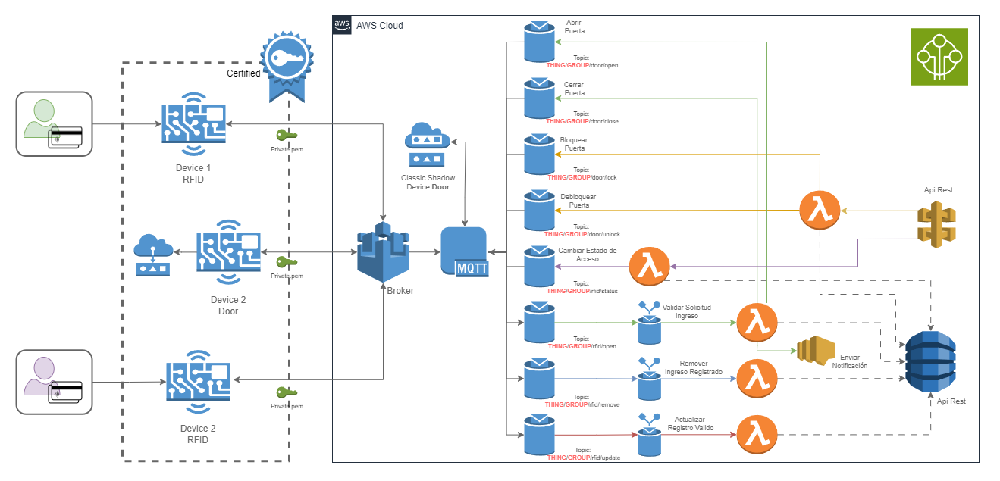

# Infraestructura del proyecto de IOT - RFID-ACCESS

Este documento detalla la infraestructura configurada para el manejo de dispositivos IoT en AWS, incluyendo la generación de llaves de encriptación, la creación de buckets en S3, la definición de dispositivos IoT y su integración con DynamoDB y AWS Lambda. Esta configuración asegura que la infraestructura esté bien gestionada, segura y escalable, cumpliendo con los requisitos de negocio y facilitando el proceso de despliegue y mantenimiento.

 

  

 

## Principales comnados

Para poder desplegar la infraestructura se debe tener en cuenta los siguientes pasos:

- Iniciar el Proyecto 
   - terraform init

- Validar Sintaxis de las declaraciones
   - terraform validate

- Validar Estado antes de enviar
   - terraform plan

- Confirmar cambios y enviar infra
   - terraform apply

- Destruir los cambios y enviar infra
   - terraform destroy

- Pasar otra cuenta de AWS
  - export AWS_PROFILE=<profile>

- Imprimir salida de variables
   - terraform output -json <variable>

O puede usar los Scripts definidos en el `package.json` para ejecutar los comandos de forma mas sencilla, recuerde cambiar el perfil de la cuenta de aws con la que crear la infraestructura.	

- Iniciar el Proyecto 
   - npm run start
  
- Validar Sintaxis de las declaraciones
    - npm run validate

- Validar Estado antes de enviar
    - npm run terra:plan

- Confirmar cambios y enviar infra
    - npm run terra:apply

- Destruir los cambios y enviar infra
    - npm run terra:destroy

Adicionalmente debe de definir el archivo de variables definidas con el flag `-var-file` o puede usar el definido en el proyecto `dev.tfvars`

> También puede pasar el flag de aprovación automatica con `-auto-approve` para evitar la confirmación de los cambios si desea incluir este desarrollo en un pipeline de CI/CD.

  
## Con Variables

 - Validar Estado antes de enviar con un archivo
   - terraform plan -var-file /pat/to/file

 - Destruir los cambios y enviar infra y con doble confirmacion 
   - terraform destroy -var-file /pat/to/file -auto-approve

---
## Servicios Principales

1. **Llaves de Encriptación**
KMS Key: Llave para encriptar datos en los buckets S3, asegurando que los datos almacenados estén protegidos.
KMS Alias: Alias asociado a la llave KMS para una fácil referencia y administración.

2. **Buckets S3**
Bucket para Infraestructura de Backend: Utilizado para controlar la infraestructura de Terraform, con reglas de encriptación utilizando la llave KMS mencionada anteriormente.

3. **Dispositivos IoT**
Definición de Tipos de Dispositivos IoT: Crea y define tipos de dispositivos IoT, permitiendo clasificaciones y búsquedas eficientes.
Módulo de Dispositivos IoT: Implementa la creación de dispositivos IoT, asignándoles políticas y certificados para asegurar la comunicación.

4. **DynamoDB**
Tabla DynamoDB para IoT: Almacena datos de dispositivos IoT, utilizando un modelo de facturación por demanda para optimizar costos.

5. **AWS Lambda**
Política de IAM para Lambda: Define los permisos necesarios para que las funciones Lambda interactúen con otros servicios AWS como CloudWatch y DynamoDB.
Módulo de Lambda: Facilita la creación y configuración de funciones Lambda, incluyendo la compresión y despliegue del código, y la integración con reglas de IoT para ejecutar lógica de negocio en respuesta a eventos IoT.

---
## Variables Utilizadas

Puede ver el archivo de variables inicializadas de ejemplo en el archivo `example.tfvars`, [aquí](example.tfvars).

#### **Generales**
- **aws_region**: Región de AWS donde se despliega la infraestructura.
- **aws_account**: ID de la cuenta AWS utilizada.
- **aws_tags**: Etiquetas generales para organizar y diferenciar recursos.
- **backend_env**: Ambiente de despliegue (desarrollo, producción, etc.).

#### **S3 y KMS**
- **bucket_backend_name**: Nombre del bucket S3 para la infraestructura de Terraform.
- **bucket_backend_tags**: Etiquetas específicas para el bucket.
- **kms_key_id**: ID de la llave de encriptación KMS.

#### **IoT**
- **thing_type_name**: Nombre del tipo de dispositivo IoT.
- **thing_type_description**: Descripción del tipo de dispositivo IoT.
- **thing_type_searchable_attributes**: Atributos buscables del tipo de dispositivo IoT.
- **iot_devices**: Lista de dispositivos IoT a crear, con sus atributos específicos.

#### **DynamoDB**
- **dynamo_table_name**: Nombre de la tabla DynamoDB.
- **dynamo_attribute_name**: Nombre del atributo clave de la tabla.

#### **Lambda**
- **lambda_policy_name**: Nombre de la política de ejecución de Lambda.
- **lambda_policy_description**: Descripción de la política.
- **lambdas_function**: Lista de funciones Lambda a crear, con sus rutas de código, nombres y configuraciones de reglas IoT asociadas.

--- 
## Proceso de Configuración

1. **Generación y Gestión de Llaves KMS**: Creación de llaves y alias KMS para encriptación de datos en S3.
2. **Configuración de Buckets S3**: Creación y configuración de buckets con reglas de encriptación.
3. **Definición y Creación de Dispositivos IoT**: Utilización de módulos para definir y crear dispositivos IoT, asignarles políticas y certificados.
4. **Configuración de DynamoDB**: Creación de tablas para almacenar datos de dispositivos IoT.
5. **Despliegue de Funciones Lambda**: Implementación de funciones Lambda, configuración de roles y permisos, y asociación con reglas IoT.